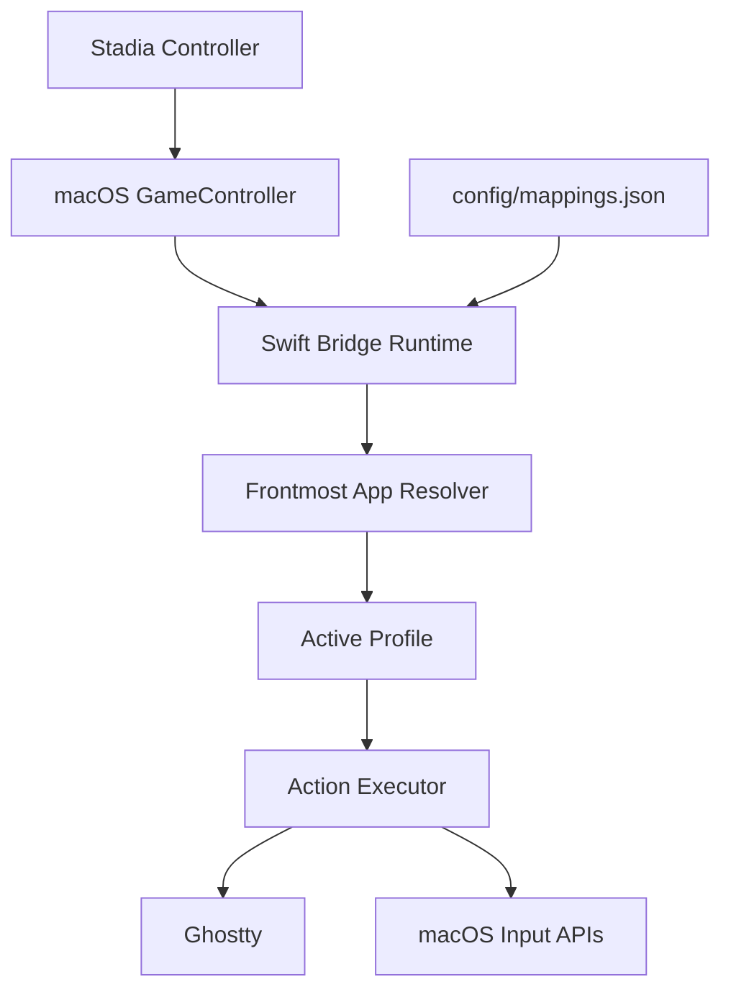

# Bridge Overview

This repo is a small local input bridge. The Stadia controller is the input device, the Swift bridge is the decision layer, and Ghostty is currently the main output target. The bridge does not try to be a full automation platform. It picks the active app profile, looks up the mapped action, and executes the smallest thing needed.

## Main Parts

- `GameController` gives the raw controller buttons and stick values.
- The Swift bridge polls inputs, applies debounce and edge-trigger rules, and chooses the active profile.
- `config/mappings.json` is the source of truth for button mappings and analog behavior.
- Ghostty-specific actions can go through three paths:
  - plain keystrokes
  - Ghostty native action dispatch
  - Ghostty AppleScript surface creation for richer tab startup behavior

## Main Flow

1. Load `config/mappings.json`.
2. Detect the connected controller and poll button/stick state.
3. Resolve the frontmost app bundle ID.
4. Pick the matching profile, plus any explicit `alwaysOn` controls.
5. Execute the mapped action.

## Action Types

- `keystroke` / `holdKeystroke`
  - generic macOS key injection
- `ghosttyAction`
  - Ghostty-native terminal action such as `next_tab`, `goto_split:next`, or `close_surface`
- `applescript`
  - richer Ghostty control for cases where a plain action is not enough, such as opening a new tab with custom startup behavior
- `text`, `shell`, `mouseClick`
  - utility paths for Codex-specific prompts and a few non-terminal actions

## Boundaries

- The bridge owns controller mapping, profile resolution, and action dispatch.
- Ghostty owns terminal/tab/split semantics.
- Machine-level install and launchd wiring live in `~/GitHub/scripts/setup/stadia/`.
- Codex shell behavior and the directory picker live in `~/.agents/codex/`.

## Notes

- Config-only mapping changes hot-reload.
- Runtime/schema changes do not hot-reload into the staged launchd app; they require reinstalling the launchd service so the staged binary is rebuilt.
- Ghostty AppleScript is currently a preview API in Ghostty `1.3.x`, but this repo uses it intentionally because it is the cleanest way to express tab-level startup behavior.
